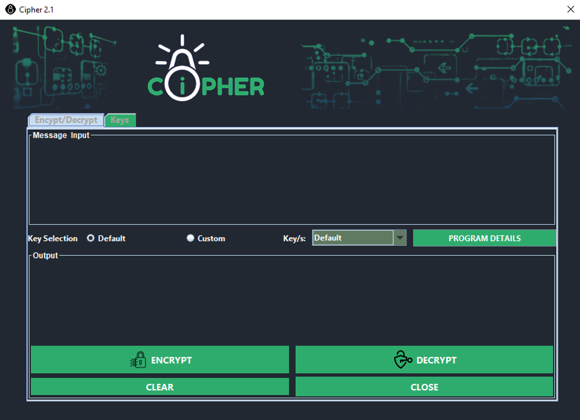
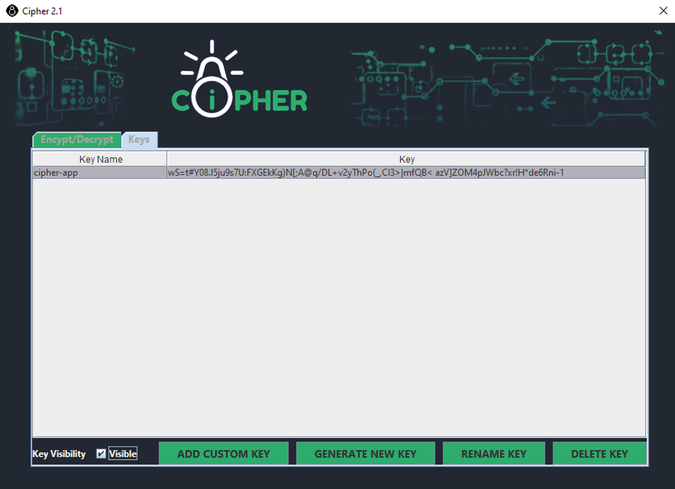

A cipher is an algorithm for encrypting and decrypting data. The application uses a cipher
to encrypt plain text messages and decrypt its encrypted messages; however, the application only
uses symmetric encryption, where only one key (a secret key) is used to both encrypt and decrypt
electronic data. Users may use the default key embedded in the program for encryption and
decryption, or they may automatically or manually generate a new key because the application
also has the capability to generate new keys, or they may let the user manually enter a key
generated by the same key generation algorithm as the system. The key generation algorithmuses a guide with only 84 characters in length; this guide is the list of all the characters that can
be used to construct a message and a custom key. Any key or message that uses characters not
included in the guide is not supported by the application. Any key that is longer or shorter than
84 characters is not accepted. Users can generate or enter any number of keys they want; there is
no programmed limitation. This application also has a table that lists existing custom keys. This
table shows the key and its corresponding key name as designated by the user. The key is masked
at first, but users have the option to view the key or mask it by ticking or unticking the visibility
checkbox. Custom keys in this application can also be deleted or renamed, while the default key
is immutable. This application is for offline use only.
